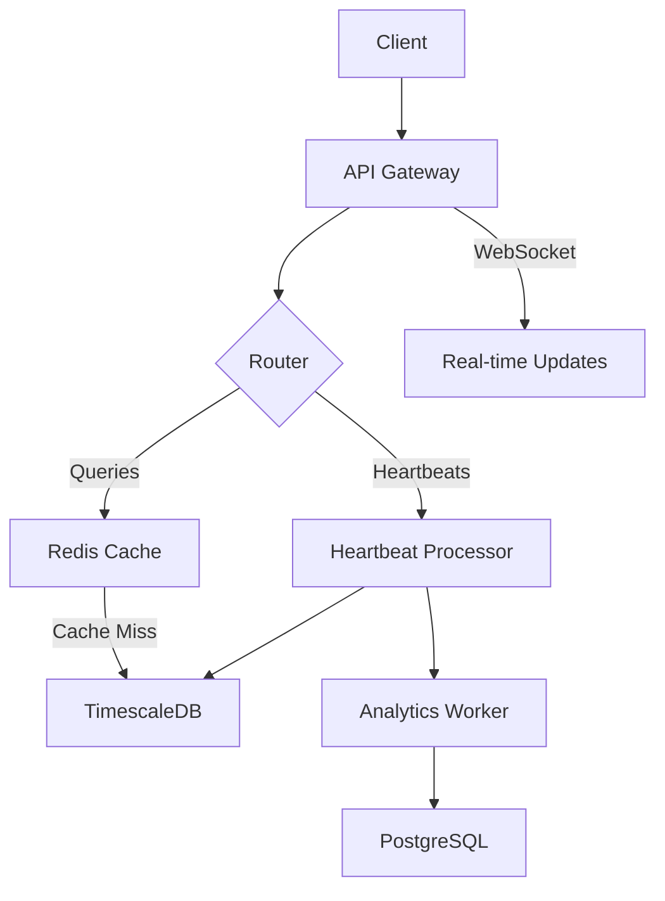

# System Architecture

## Overview

CodeTime Analytics is built on a scalable architecture designed for high performance and real-time data processing. The system consists of several key components that work together to provide a robust coding analytics platform.

## Core Components

### 1. API Gateway (Express.js)

- Entry point for all client requests
- Handles authentication and authorization
- Rate limiting and request validation
- Routes requests to appropriate services
- Direct Heartbeat processing

### 2. Data Storage Layer

#### PostgreSQL with TimescaleDB

- Stores time-series data for coding activities
- Optimized for time-based queries
- Automatic data partitioning and retention
- Schema:

  ```sql
  -- Heartbeats table
  CREATE TABLE Heartbeats (
    id SERIAL PRIMARY KEY,
    user_id UUID,
    timestamp TIMESTAMPTZ,
    entity TEXT,
    type TEXT,
    project TEXT,
    language TEXT,
    lines INTEGER,
    line_delta INTEGER
  );

  -- Create hypertable
  SELECT create_hypertable('Heartbeats', 'timestamp');
  ```

#### PostgreSQL (User Data)

- Stores user profiles and metadata
- Handles authentication data
- Manages team and collaboration info

#### Redis

- Caching layer for frequent queries
- Session management
- Rate limiting counters
- Real-time analytics

### 3. Background Processing

#### Heartbeat Processing

- Direct processing in API layer
- Efficient batch processing
- Deduplication logic
- Real-time analytics updates

#### Analytics Processing

- Scheduled background jobs
- Report generation
- Trend analysis
- Performance metrics calculation

### 4. WebSocket Server

- Real-time updates
- Live collaboration features
- Instant notifications

## Data Flow



## Security Architecture

### Authentication Flow

1. OAuth providers (Twitter, LinkedIn)
2. JWT token generation
3. Token validation middleware
4. Role-based access control

### Data Protection

- End-to-end encryption for sensitive data
- Data anonymization for analytics
- Regular security audits

## Scalability Design

### Horizontal Scaling

- Stateless API servers
- Redis cluster for caching
- Database read replicas

### Performance Optimizations

1. Query Optimization

   - Materialized views
   - Efficient indexing
   - Query caching

2. Caching Strategy

   - Multi-level caching
   - Cache invalidation patterns
   - Cache warming

3. Batch Processing
   - Efficient Heartbeat batching
   - Background processing
   - Optimized database operations

## Monitoring and Observability

### Metrics Collection

- Request latency
- Error rates
- System resources
- Business metrics

### Logging

- Structured logging
- Log aggregation
- Error tracking

### Alerting

- Performance thresholds
- Error spikes
- System health

## Disaster Recovery

### Backup Strategy

1. Database Backups

   - Full daily backups
   - Incremental hourly backups
   - Point-in-time recovery

2. Configuration Backups
   - Version controlled
   - Infrastructure as code
   - Automated deployment

### Recovery Procedures

1. Database Failover
2. Service Restoration
3. Data Consistency Checks

## Development Workflow

### Code Organization

```
src/
├── config/         # Configuration files
├── routes/         # API routes
├── middleware/     # Express middleware
├── models/         # Data models
├── services/       # Business logic
├── workers/        # Background workers
├── utils/          # Helper functions
└── tests/          # Test files
```

### Testing Strategy

1. Unit Tests
   - Individual components
   - Mocked dependencies
2. Integration Tests
   - API endpoints
   - Database interactions
3. Load Tests
   - Performance benchmarks
   - Stress testing

## Future Considerations

### Planned Improvements

1. Machine Learning Pipeline

   - Code pattern analysis
   - Productivity predictions
   - Anomaly detection

2. Enhanced Analytics

   - Team productivity metrics
   - Project health indicators
   - Custom reporting engine

3. Scale Optimizations
   - GraphQL API
   - Edge caching
   - Serverless functions
